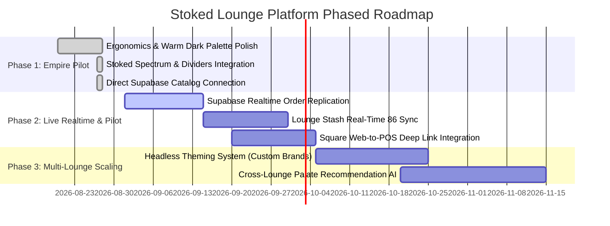

# Stoked Lounge Ecosystem & Universal Backend Master Plan

This document outlines the strategic, technical, and operational blueprint for offering **Complimentary Turnkey Lounge Portals (POS & Interactive QR Menus)** powered by the **Stoked Hookah Network**.

---

## 1. Executive Vision & The Flywheel Model

```
┌─────────────────────────────────────────────────────────────────────────────┐
│                             THE STOKED FLYWHEEL                             │
│                                                                             │
│  ┌─────────────────────────┐                     ┌───────────────────────┐  │
│  │   LOUNGE VALUE ($0)     │                     │   STOKED ECOSYSTEM    │  │
│  │ • $0 POS & Floor Deck   │                     │ • Low-CAC User Growth │  │
│  │ • 25m Coal Timers       │────────────────────>│ • Real-World Tasting  │  │
│  │ • Sommelier Mix Lab     │                     │   Data & Palate Trends│  │
│  │ • Digital QR Menu       │<────────────────────│ • High-Margin Brand   │  │
│  └─────────────────────────┘  Brand Partnerships │   Intelligence Value  │  │
│                               & User Loyalty     └───────────────────────┘  │
└─────────────────────────────────────────────────────────────────────────────┘
```

* **For the Lounge**: Saves \$200–\$500/month in software fees, eliminates burned tobacco heads with coal alerts, increases check averages via craft mix upsells, and keeps 100% of revenue through their existing payment terminal.
* **For Stoked**: Turns partner lounges into high-converting consumer acquisition engines while generating industry-first blend consumption intelligence.

---

## 2. Technical Traffic & Server Load Analysis

### Realistic Traffic Projections

A typical high-volume craft hookah lounge operates with:
* **Seating Capacity**: 20 to 50 active tables/booths.
* **Turnover**: 1.5 to 2.5 turns per night (~40 to 100 sessions per day).
* **Nightly Visitors**: ~80 to 250 guests.

```
┌───────────────────────────────────────────────────────────────────────────┐
│              TRAFFIC & API ESTIMATES PER INDIVIDUAL LOUNGE                │
├─────────────────────────┬───────────────────┬─────────────────────────────┤
│ Interaction Type        │ Calls / Night     │ Bandwidth / Payload         │
├─────────────────────────┼───────────────────┼─────────────────────────────┤
│ Initial Menu & Catalog  │ ~150 page loads   │ Cached client-side (<5ms)   │
│ Live Table State/Orders │ ~300 – 600 events │ Tiny JSON packets (<2 KB)   │
│ Member Auth & Check-ins │ ~40 – 80 requests │ Standard Auth endpoint      │
├─────────────────────────┼───────────────────┼─────────────────────────────┤
│ TOTAL DAILY API CALLS   │ ~500 – 1,000 / day│ Easily within Supabase Pro  │
└─────────────────────────┴───────────────────┴─────────────────────────────┘
```

> [!NOTE]
> **Key Finding**: One lounge—or even a pilot cohort of 5 to 10 lounges—represents a very light traffic footprint. It will **not** overwhelm standard cloud backends.

---

## 3. Required Backend Upgrades & Infrastructure Roadmap

While raw request volume is modest, supporting live commercial lounge operations requires targeted infrastructure upgrades:

### A. Real-Time Synchronization (Supabase Realtime / WebSockets)
* **Requirement**: When a customer submits a mix from Table 4 on their phone, the Staff POS screen must pop the preparation ticket in under 500ms without manual page refreshing.
* **Implementation**: Enable Supabase Realtime row-level replication on the `lounge_orders` and `lounge_tables` tables.

### B. Row-Level Security (RLS) & Multi-Tenant Data Isolation
* **Requirement**: Complete isolation of proprietary lounge data. No lounge staff or owner can ever query another lounge's sales receipts, open tabs, or private hospitality notes.
* **Policy Architecture**:
  ```sql
  -- Example: Lounge Staff can only access tables in their assigned lounge
  CREATE POLICY "Lounge Staff Access Only" ON lounge_tables
    FOR ALL
    USING (lounge_id = auth.jwt() ->> 'managed_lounge_id');
  ```

### C. Client-Side Shift Caching (Offline Resilience)
* **Requirement**: If a lounge's Wi-Fi drops on a Saturday at 11:30 PM, the staff floor chart and menu must stay operational.
* **Implementation**: The application caches the active catalog and open table state in browser `localStorage` / `IndexedDB`, auto-reconciling changes when connectivity restores.

---

## 4. The Data Privacy Boundary

```
┌────────────────────────────────────────────────────────────────────────┐
│                   PRIVATE TO EACH INDIVIDUAL LOUNGE                    │
│                 (Strictly Siloed — Never Shared)                       │
├────────────────────────────────────────────────────────────────────────┤
│  ✗ Table Tab Spend & Receipt History (Dollar amounts, payment methods) │
│  ✗ Private Staff Notes (e.g., "Regular customer, prefers Table 4")     │
│  ✗ Local Loyalty Points & Rewards Tiers                                │
│  ✗ Proprietary House Mix Recipes (Unless published publicly)           │
└────────────────────────────────────────────────────────────────────────┘

                                    ▲
                         STRICT PRIVACY WALL
                                    ▼

┌────────────────────────────────────────────────────────────────────────┐
│                    PORTABLE WITH THE CUSTOMER                          │
│                   (Belongs to the User Profile)                        │
├────────────────────────────────────────────────────────────────────────┤
│  ✓ Universal Palate Archetype (e.g., "Berries + Mints, 0% Anise")      │
│  ✓ Nicotine Buzz Tolerance (e.g., "Prefers Dark Leaf ~7.5")            │
│  ✓ Smoking Style Preferences (e.g., "Phunnel Bowl · HMD")              │
│  ✓ Personal Saved Recipes (Blends the user saved to their profile)     │
└────────────────────────────────────────────────────────────────────────┘
```

---

## 5. POS & Payment Settlement Strategy

To eliminate legal, PCI-DSS compliance, and financial liability:
* **Stoked Never Touches the Money**: 100% of payment collection occurs through the lounge's existing payment processors.
* **Tender Agnostic**: Staff can tender bills using cash, physical card terminals (Square, Clover, Toast), or app deep links.

```
┌─────────────────────────────────────────────────────────────────────────────┐
│                    PAYMENT SETTLEMENT OPTIONS FOR LOUNGES                   │
├──────────────────────────────────────┬──────────────────────────────────────┤
│ METHOD                               │ OPERATIONAL FLOW                     │
├──────────────────────────────────────┼──────────────────────────────────────┤
│ 1. Terminal-Agnostic (Day 1)         │ Staff swipes card on existing reader,│
│                                      │ taps [ Settle & Close ] on staff.html│
│                                      │                                      │
│ 2. Square App-to-App Deep Linking    │ PWA triggers `square-commerce-v1://` │
│    (iOS & Android Intents)           │ or Android Intent; opens Square POS  │
│                                      │ with exact dollar amount pre-filled. │
│                                      │                                      │
│ 3. Square Terminal API (Cloud Push)  │ Optional cloud webhook pushes amount │
│                                      │ directly to standalone Square reader.│
└──────────────────────────────────────┴──────────────────────────────────────┘
```

---

## 6. Phased Implementation Roadmap



### Phase Details & Action Items

| Phase | Core Deliverable | Key Technical Objective |
| :--- | :--- | :--- |
| **Phase 1: Empire Reference Implementation** *(Current)* | Standalone Empire POS & Menu | Clean soft dark UI, 25m coal timers, Stoked botanical color spectrum, Supabase catalog connection. |
| **Phase 2: Live Operational Pilot** *(Weeks 1–4)* | Realtime Kitchen/Bar Prep Sync | WebSockets for instantaneous table-to-staff order pushing; optional Square App-to-App deep linking. |
| **Phase 3: Multi-Tenant Lounge Engine** *(Months 2–3)* | Headless Themeable Lounge SaaS | Reusable theme tokens (palettes, fonts, floorplans) enabling rapid onboarding for new lounges on `[slug].stoked.menu`. |
| **Phase 4: Universal Palate Network** *(Quarter 2)* | Cross-Lounge Discovery & Palate AI | Matching traveling users' universal flavor preferences against local partner lounge inventories. |

---

## 7. Open Questions & Alignment Check

> [!IMPORTANT]
> 1. **Immediate Focus**: Are we aligned on keeping Empire as the primary, polished reference pilot before building multi-tenant infrastructure?
> 2. **Square Deep Linking**: Would you like to test the Square App-to-App payment trigger on a physical Android/iPad device during the Phase 2 testing window?
